# React Select Dropdown (Reusable Component) Documentaion & Testing

Reusable Select Dropdown made with React, SASS and Storybook support for interaction and testing.
<br>
Live Link: [Dropdown](https://upbeat-bhaskara-9ce05d.netlify.app/).
<br><br>

## Run
REACT APP: `npm install, npm start`<br>
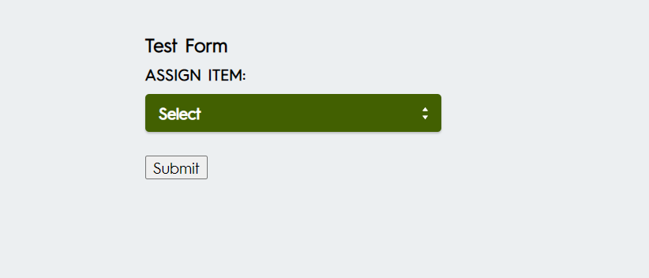

OR<br>
Storybook: `npm install, npm run storybook`
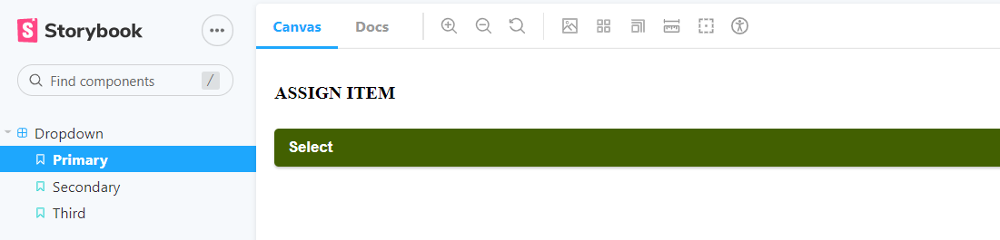
<br><br>


## Usage
To use drop down component, import and declare props.<br>
````js
import Data from './data/assignes.json' // JSON datafile path
import Dropdown from './stories/Dropdown'; // dropdown reusable component

const Datafile = Data; // JSON datafile

<Dropdown 
    Datafile={Datafile}
    DatafileNameValue='name'
    ButtonID='button-person'
    SelectLabelID='person'
    SelectLabelText='ASSIGN ITEM:'
    SelectMaxSize={10}
    InputPlaceHolderText='Search for a user'
    SelectColourBG='pink'
/>
````
<br>


## Component Prop Options
| Prop Name       | Description           | Default  | Type  |
| ------------- |:-------------:| -----:| -----:|
| Datafile | JSON File to use | {Datafile} | `JSON File` |
| DatafileNameValue | value in JSON file for name | 'name' | `string` |
| ButtonID | Button ID | 'button-person' | `string` |
| SelectLabelID | Select and Select Label ID | 'person' | `string` |
| SelectLabelText | Select Label innner html | 'ASSIGN ITEM:' | `string` |
| SelectMaxSize | Max list size to enable scrolling | {10} | `int` |
| InputPlaceHolderText | Input placeholder default text | 'Search for a user' | `string` |
| SelectColourBG | Selected option Bg color value, can be color name (pink) or hex value (#CCC) | 'pink' | `string` |
<br><br>


## Storybook
Storybook contains 3 dropdown types;<br><br>
<b>Primary</b>: uses full JSON list of 13 names to show scroll and input filter<br>
<b>Secondary</b>: uses short JSON list of 5 names with no scroll or input filter<br>
<b>Third</b>: shows short list with names value defined as 'person' in JSON list.<br>
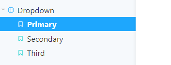
<br><br>

### Story Book Accessibility Tab<br>
You can review the accesibily tests for the dropdown by selecting the Accessibility tab
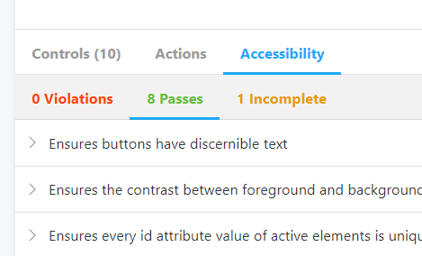
<br><br>

### Storybook Canva Tab Bug<br>
There is bug when viewing the dropdown in the `Canva Tab`, whereby you need to double click to confirm your selected option. This is bug and the dropdown works fine if you use the `Docs tab` to view and run the dropdown instead or if you run the dropdown via `npm start`
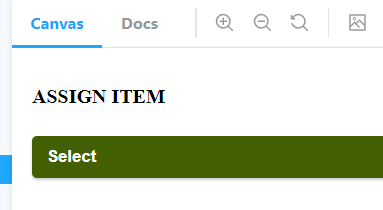
<br><br>
Use the `Docs Tab` to accurately view the dropdown and interact with it.
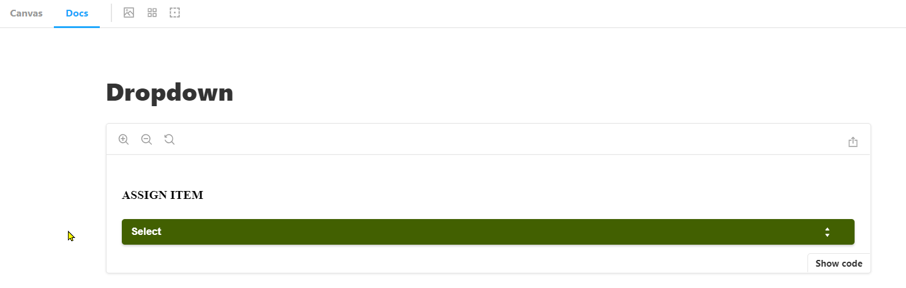
<br><br>


## Testing
run `npm test` to perform testing<br>
Test to ensure page renders by checking if h2 title element loads in page. 
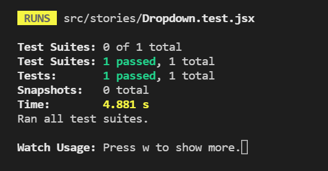
<br><br>


## Other Testing

[HTML Validation](https://validator.w3.org/nu/?doc=https://upbeat-bhaskara-9ce05d.netlify.app/)
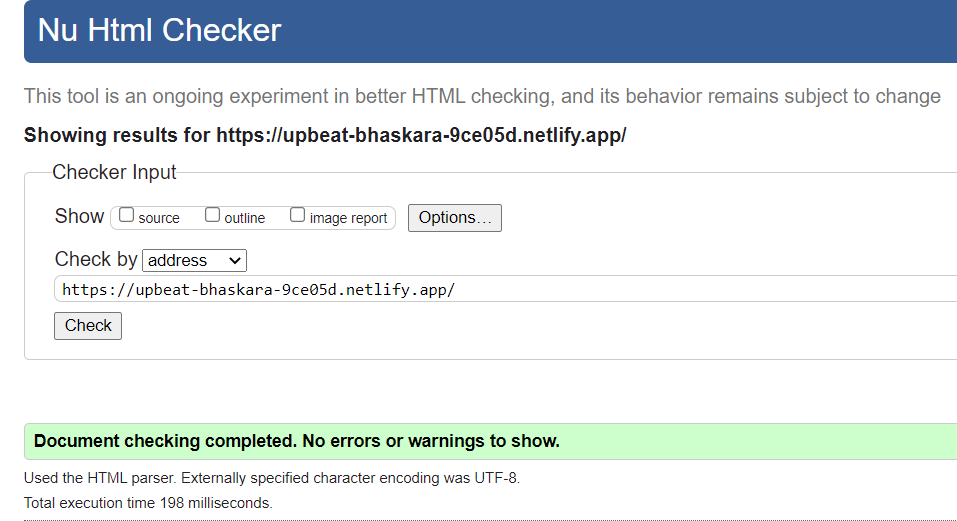

[CSS Validation](https://jigsaw.w3.org/css-validator/validator?profile=css3&warning=0&uri=https://upbeat-bhaskara-9ce05d.netlify.app/)
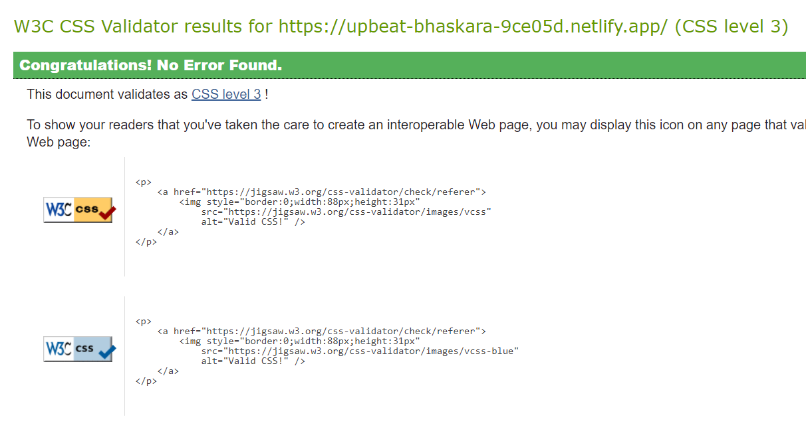

[Accessibility Validation](https://wave.webaim.org/report#/https://upbeat-bhaskara-9ce05d.netlify.app/)
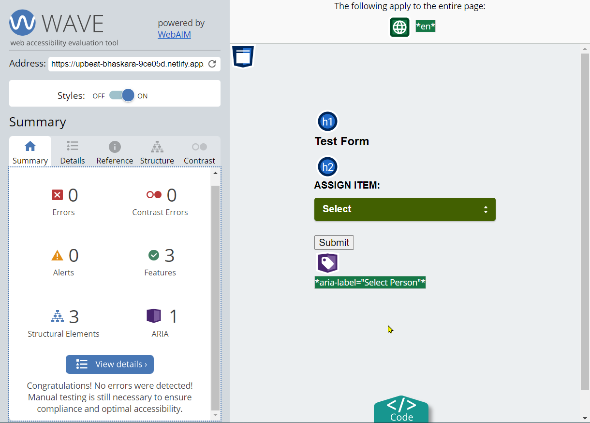

Lighthouse Validation (Desktop/Mobile)
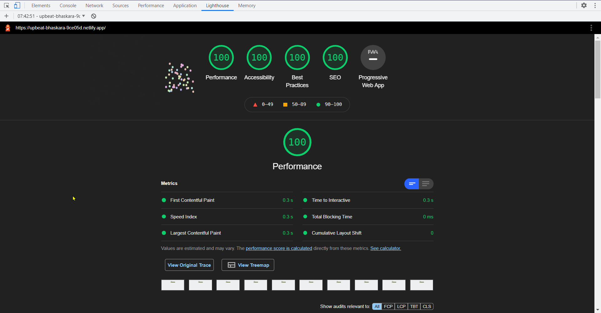
<br><br>


## Created By
Author: Rishi Bhachu<br>
Contact: mr_bhachu@hotmail.com